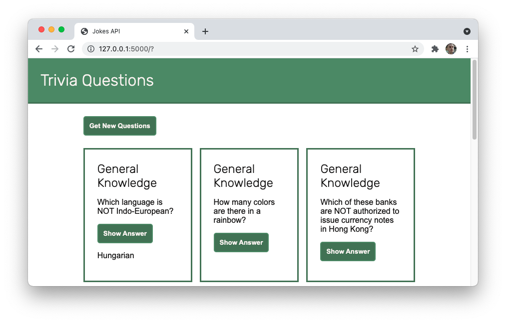

# API Calls with Fetch

Now that you can access data from JSON APIs, build a trivia application that makes use of the [Open Trivia Database](https://opentdb.com/api_config.php).



---

## Lab Setup

### Getting started

1. Fork and clone this repository.

1. Navigate to the cloned repository's directory on your command line. Then, run the following command:

   ```
   npm install
   ```

   This will install the libraries needed to run the tests.

1. Open up the repository in VSCode. Follow the instructions below to complete the Lab.

### Tests

To run the tests, you can run the following command from the command line. You will need to be in the root directory of your local directory.

```
npm test
```

This will open the Cypress testing window, where you can click to run an individual suite of tests or all of the tests at once.

## Instructions

Using the [Open Trivia Database](https://opentdb.com/api_config.php), update the form so that when it is submitted 10 new trivia questions appear on the page.

You may use the following HTML format for each trivia question. Replace the text with the relevant values from the API.

```html
<article class="card">
  <h2>CATEGORY</h2>
  <p>QUESTION</p>
  <button>Show Answer</button>
  <p class="hidden">CORRECT ANSWER</p>
</article>
```

For the tests to pass, each question needs the `.card` class.

For each trivia question, then make it so that clicking on the button reveals the correct answer.

Once you have completed the base requirements above, complete the following tasks _as time allows._

- [ ] The API returns a "difficulty" key which categorizes the question based on how difficult it is. Display this difficult on the page through both text and CSS. For example, you may change the border color of the `.card` element to yellow if it is a medium difficulty question.

- [ ] Add a dropdown to the form so that the user can select what category they'd like for their questions. When the form is submitted, update the API call so that only those types of questions are retrieved.

- [ ] The multiple choice questions include a series of incorrect answers in addition to the correct answer. Update your web application so that all of the answers are displayed. Then, have the button click highlight the correct answer with CSS.
